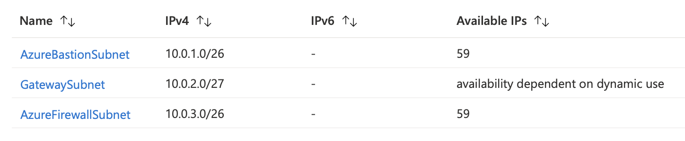
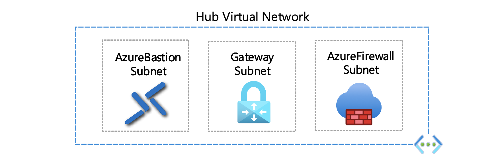
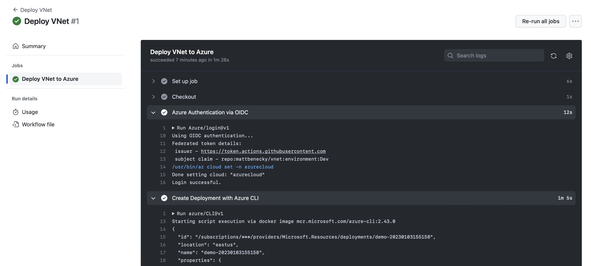

# Virtual Network (VNet)

This provides a sample virtual network to enable Azure resources to securely communicate with each other, the internet, and on-premises networks.

- Communicate with the internet
- Communicate between Azure resources
- Communicate with on-premises resources
- Filter network traffic
- Route network traffic
- Virtual network integration for Azure services



## Getting Started

1. Fork this repository into your account.

2. Launch [Cloud Shell](https://shell.azure.com/bash). (Open Link in New Tab)

```COPY``` the following line 👇
```
curl -LJO https://raw.githubusercontent.com/mattbenecky/vnet/main/src/infra/setup.sh && chmod +x setup.sh && ./setup.sh
```
```PASTE``` in [Cloud Shell](https://shell.azure.com/bash) & press ```ENTER```


3. Get your GitHub secrets ready:

```CLIENT_ID```
```TENANT_ID```
```SUBSCRIPTION_ID```


## Deploy Virtual Network

When creating a VNet, it is recommended that you use the address ranges enumerated in [RFC 1918](https://datatracker.ietf.org/doc/html/rfc1918), which have been set aside by the IETF for private, non-routable address spaces:

```10.0.0.0 - 10.255.255.255```
```172.16.0.0 - 172.31.255.255```
```192.168.0.0 - 192.168.255.255```



1. Run GitHub Actions workflow ```Deploy VNet```



## Cleaning Up

1. Launch [Cloud Shell](https://shell.azure.com/bash). (Open Link in New Tab)

```COPY``` the following line 👇
```
curl -LJO https://raw.githubusercontent.com/mattbenecky/vnet/main/src/infra/cleanup.sh && chmod +x cleanup.sh && ./cleanup.sh
```
```PASTE``` in [Cloud Shell](https://shell.azure.com/bash) & press ```ENTER```
